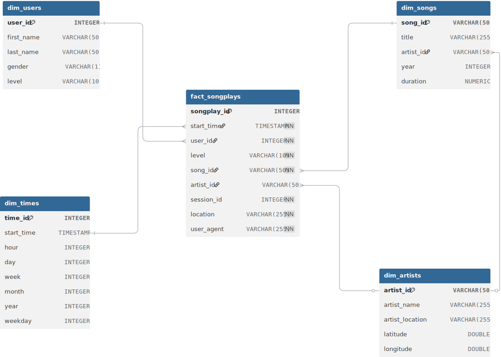

# Data Warehouse with AWS RedShift
## Introduction
A music streaming startup, Sparkify, has grown their user base and song database and
want to move their processes and data onto the cloud. The data resides in S3, in a directory
of JSON logs on user activity on the app, as well as a directory with JSON metadata on the 
songs in their app.

As the data engineer, we are to build an ETL pipeline that extracts the data from S3, 
stages them in Redshift and transforms the data into a set of dimensional tables for
the analytics team to continue finding insights into what songs users are listening to.

### Project Datasets
Two datasets stored in S3
- Song data: `s3://udacity-dend/song-data`
- Log data: `s3://udacity-dend/log_data`

To properly read log data `s3://udacity-dend/log_data`, we use the metadata file
- Log metadata: `s3://udacity-dend/log_json_path.json`

#### Song Dataset
This a subset of real data from the [Million Song Dataset](http://millionsongdataset.com/). 
Each file is in JSON format and contains metadata about a song and the artist of that song.
The files are partitioned by the first three letters of each song's track ID, like this:
```
song_data/A/B/C/TRABCEI128F424C983.json
song_data/A/A/B/TRAABJL12903CDCF1A.json
```
A single song file e.g. `TRAABJL12903CDCF1A.json` looks like this:
```json
{ "num_songs": 1, 
  "artist_id": "ARJIE2Y1187B994AB7", 
  "artist_latitude": null, 
  "artist_longitude": null, 
  "artist_location": "", 
  "artist_name": "Line Renaud", 
  "song_id": "SOUPIRU12A6D4FA1E1", 
  "title": "Der Kleine Dompfaff", 
  "duration": 152.92036, 
  "year": 0}
```

#### Log Dataset
The log dataset consists of log files in JSON format generated
by this [event simulator](https://github.com/Interana/eventsim) based
on the songs in the dataset above. These simulate app activity logs from
an imaginary music streaming app based on configuration settings.

The log files in the dataset you'll be working with are partitioned by year and
month. For example:
```
log_data/2018/11/2018-11-12-events.json
log_data/2018/11/2018-11-13-events.json
```
Here's an example of data in the log file:
```json
{
  "artist":null,
  "auth":"Logged In",
  "firstName":"Adler",
  "gender":"M",
  "itemInSession":0,
  "lastName":"Barrera",
  "length":null,
  "level":"free",
  "location":"New York-Newark-Jersey City, NY-NJ-PA",
  "method":"GET",
  "page":"Home",
  "registration":1540835983796.0,
  "sessionId":248,
  "song":null,
  "status":200,
  "ts":1541470364796,
  "userAgent":"\\"Mozilla\\/5.0 (Macintosh; Intel Mac OS X 10_9_4) AppleWebKit\\/537.78.2 (KHTML, like Gecko) Version\\/7.0.6 Safari\\/537.78.2\\"",
  "userId":"100"
} 
```

#### Log JSON Metadata
The `log_json_path.json` file is used when loading JSON data into Redshift.
It specifies the structure of the JSON data so Redshift can properly parse and load it into
staging tables.

Here's the content of the `log_json_path.json`
```json
{
  "jsonpaths": [
    "$.artist",
    "$.auth",
    "$.firstName",
    "$.lastName",
    "$.gender",
    "$.itemInSession",
    "$.length",
    "$.level",
    "$.location",
    "$.method",
    "$.page",
    "$.registration",
    "$.sessionId",
    "$.song",
    "$.status",
    "$.ts",
    "$.userAgent",
    "$.userId"
  ]
}
```

## Setting up Cloud Infrastructure in AWS for the Data Warehouse
This sections requires some AWS knowledge and an account. 

### Creating an IAM User
We will create an IAM user with permissions IAMFullAccess, S3ReadOnly and RedshiftFullAccess. 
Visit [Create an IAM user in your AWS account](https://docs.aws.amazon.com/IAM/latest/UserGuide/id_users_create.html) to
learn to users and attach permission policies to the user. The user does not need to have
access to the AWS management console. This repo tries to setup the whole AWS Data warehouse from code,
i.e. Infrastructure as Code (IaC).

Once you have your AWS user created and permissions attached, we need to generate access keys.
The access key and secret is set in the file `dwh.cfg`. Create a `dwh.cfg` file with content from
template file `dwh.cfg.example`
Under the [AWS] section input `KEY` and `SECRET`
```properties
KEY=xxxx
SECRET=xxxx
```

### Redshift cluster setup
Visit [Redshift provisioned clusters](https://docs.aws.amazon.com/redshift/latest/mgmt/working-with-clusters.html) for 
details on clusters.
Under the `[DWH]` section of `dwh.cfg`, enter values for
```properties
DB_NAME=XXX
DB_USER=XXX
DB_PASSWORD=XXXX
DB_PORT=5439
DWH_CLUSTER_TYPE=[multi-node / single-node] <Choose one>
DWH_NUM_NODES=4 <>
DWH_NODE_TYPE=ra3.large
DWH_IAM_ROLE_NAME=dwhRole <Name your IAM role to be created>
DWH_CLUSTER_IDENTIFIER=dwhCluster <Name your cluster identifier>
```

The `HOST` variable under `[DWH]` section of `dwh.cfg` can be updated after a cluster
is created. Same for `ARN` under `[IAM_ROLE]` section. These values will be available once
you run 
```commandline
python redshift_setup.py --create
```

You should see these lines in the console output:
```
✅ IAM Role ARN: <your_role_arn>
```
```
🔗 Cluster endpoint: <your_endpoint_url>
```
Copy `<your_role_arn>` into `ARN` under `[IAM_ROLE]` section of `dwh.cfg` file
Copy `<your_endpoint_url>` into `HOST` under `[DWH]` section of `dwh.cfg` file

#### Creating a cluster via code
Once you have setup the cluster configuration variables in `dwh.cfg` you can run
these commands to create, test connection or delete your cluster

Create cluster (also includes test connection). The test may fail during creation so you can
always use the test command to test after creating the cluster.
```commandline
python redshift_setup.py --create
```

Test cluster
```commandline
python redshift_setup.py --test
```

Delete cluster
```commandline
python redshift_setup.py --delete
```

### Creating tables
Run `create_tables.py` to create staging and analytical tables
```commandline
python create_tables.py
```

### Loading data into the cluster
Run `etl.py` to load staging and analytical tables
```commandline
python etl.py
```

### Schema design
The schema follows a **star schema** with `fact_songplays` as the central fact table
and four dimension tables: `dim_users`, `dim_songs`, `dim_artists` and `dim_times`. 
This design is optimized for analytical queries on song plays.

#### Schema Diagram


#### Tables Overview

- `fact_songplays`: Fact table recording song play events with references to users, songs, artists and time. The column `start_time` is used as a sortkey 
- `dim_users`: Dimension table with user attributes (name, gender, subscription level). This table is very small so the distribution style selected is `ALL` so a copy is available on each slice for efficient joins.
- `dim_songs`: Dimension table containing song details like title, artist, year, and duration.
- `dim_artists`: Dimension table with artist metadata including location and geocoordinates.
- `dim_times`: Dimension table that breaks down timestamps into hour, day, week, month, year, and weekday for time-based analytics

#### Table Design and Justification
#### `fact_songplays`
- **Purpose**: Captures user song play events (facts).
- **Primary Key**: `songplay_id`
- **Sort Key**: `start_time` — optimizes queries filtered or ordered by time.
- **Diststyle**: `AUTO` — lets Redshift determine the optimal distribution, avoiding manual skew due to high cardinality fields like `user_id` or `song_id`.
- **Rationale**: As the largest table in a star schema, it joins frequently with dimensions. `AUTO` distribution ensures optimal performance without manual tuning until the dataset grows.

#### `dim_users`
- **Purpose**: Stores user information.
- **Primary Key**: `user_id`
- **Sort Key**: `user_id`
- **Diststyle**: `ALL` — table is small, so full replication avoids shuffling during joins.
- **Rationale**: Fast access for frequent joins with the fact table without distribution overhead.

#### `dim_songs`
- **Purpose**: Contains metadata about songs.
- **Primary Key**: `song_id`
- **Sort Key**: `title` — supports pattern-based song searches.
- **Dist Key**: `artist_id` — offers relatively balanced distribution based on cardinality analysis.
- **Rationale**: Hashing on `artist_id` distributes rows evenly while keeping related records near each other for better join performance with `dim_artists`.

#### `dim_artists`
- **Purpose**: Contains artist information.
- **Primary Key**: `artist_id`
- **Sort Key**: `artist_name`
- **Diststyle**: `AUTO`
- **Rationale**: Redshift determines best distribution. `artist_id` had high skew potential, so letting Redshift optimize avoids performance issues.

#### `dim_times`
- **Purpose**: Breakdown of timestamps for time-based analysis.
- **Primary Key**: `time_id`
- **Sort Key**: `start_time`
- **Diststyle**: `AUTO`
- **Rationale**: Enables efficient time-based filtering. AUTO distribution works well due to its modest size.

#### `staging_events` & `staging_songs`
- **Purpose**: Temporary holding tables for raw data from S3 before transformation.
- **Diststyle**: `EVEN` — balances rows across slices.
- **Rationale**: Not used for joins, so even distribution is simplest and most efficient.

#### Distribution Strategy Overview

| Table             | Diststyle | Distkey       | Sortkey       |
|------------------|-----------|---------------|---------------|
| fact_songplays   | AUTO      | —             | start_time    |
| dim_users        | ALL       | —             | user_id       |
| dim_songs        | KEY       | artist_id     | title         |
| dim_artists      | AUTO      | —             | artist_name   |
| dim_times        | AUTO      | —             | start_time    |
| staging_events   | EVEN      | —             | —             |
| staging_songs    | EVEN      | —             | —             |

#### Notes
- `DISTSTYLE ALL` is ideal for small dimension tables.
- `AUTO` is recommended when unsure or to avoid skew, especially with high-cardinality or skewed data.
- Sort keys are chosen based on the most common filter and join operations.

### 📈Analytics and Insights
Once the data warehouse is populated with transformed data, we can run several analytical queries to
uncover user behaviour and music trends. The query time reduces significantly after the first query.

Run this command to execute the example queries
```commandline
python example_queries.py
```

Below are the insights derived:

#### 📊Top 10 Most Played Songs
⏱️ *Query time: 6.3922 seconds*

| Title | Play Count |
|-------|------------|
| You're The One | 37 |
| I CAN'T GET STARTED | 9 |
| Catch You Baby (Steve Pitron & Max Sanna Radio Edit) | 9 |
| Nothin' On You [feat. Bruno Mars] (Album Version) | 8 |
| Hey Daddy (Daddy's Home) | 6 |
| Make Her Say | 5 |
| Up Up & Away | 5 |
| Unwell (Album Version) | 4 |
| Mr. Jones | 4 |
| Supermassive Black Hole (Album Version) | 4 |

---

#### 📊 Top 10 Most Active Users
⏱️ *Query time: 7.4006 seconds*

| User ID | First Name | Last Name | Play Count |
|---------|------------|-----------|------------|
| 49 | Chloe | Cuevas | 42 |
| 97 | Kate | Harrell | 32 |
| 80 | Tegan | Levine | 31 |
| 44 | Aleena | Kirby | 21 |
| 73 | Jacob | Klein | 18 |
| 88 | Mohammad | Rodriguez | 17 |
| 15 | Lily | Koch | 15 |
| 36 | Matthew | Jones | 13 |
| 29 | Jacqueline | Lynch | 13 |
| 24 | Layla | Griffin | 13 |

---

#### 📊 Most Popular Artists  
⏱️ *Query time: 5.4662 seconds*

| Artist Name | Play Count |
|-------------|------------|
| Dwight Yoakam | 37 |
| Kid Cudi / Kanye West / Common | 10 |
| Kid Cudi | 10 |
| Ron Carter | 9 |
| Lonnie Gordon | 9 |
| B.o.B | 8 |
| Usher | 6 |
| Usher featuring Jermaine Dupri | 6 |
| Muse | 6 |
| Richard Hawley And Death Ramps / Arctic Monkeys | 5 |

---

#### 📊 Top 10 Locations by Song Plays 
⏱️ *Query time: 0.3152 seconds*

| Location | Play Count |
|----------|------------|
| San Francisco-Oakland-Hayward, CA | 42 |
| Lansing-East Lansing, MI | 32 |
| Portland-South Portland, ME | 31 |
| Waterloo-Cedar Falls, IA | 21 |
| Tampa-St. Petersburg-Clearwater, FL | 18 |
| Sacramento--Roseville--Arden-Arcade, CA | 17 |
| Atlanta-Sandy Springs-Roswell, GA | 17 |
| Chicago-Naperville-Elgin, IL-IN-WI | 15 |
| Lake Havasu City-Kingman, AZ | 13 |
| Janesville-Beloit, WI | 13 |

---

#### 📊 Song Plays by Weekday
⏱️ *Query time: 6.7162 seconds*

| Weekday | Weekday Name | Play Count |
|---------|--------------|------------|
| 0 | Sunday | 16 |
| 1 | Monday | 62 |
| 2 | Tuesday | 45 |
| 3 | Wednesday | 61 |
| 4 | Thursday | 65 |
| 5 | Friday | 53 |
| 6 | Saturday | 31 |